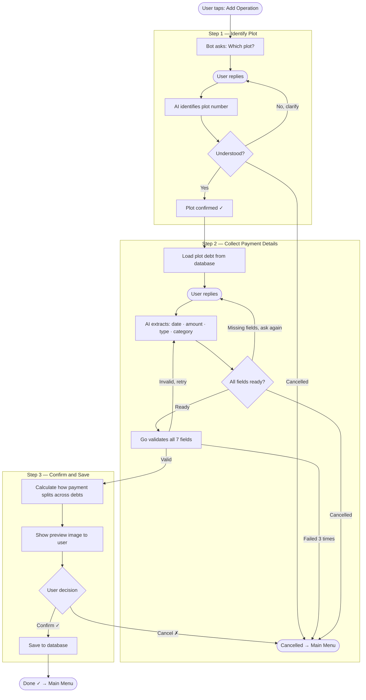

# SNT Finance Bot

Telegram bot for recording and managing SNT (garden non-profit partnership) financial operations. Collects transactions via a two-phase AI conversation, validates them deterministically in Go, and writes to SQLite only after explicit user confirmation.

---

## Architecture

Two hard layers. AI never touches the database.

```
User message
  │
  ▼
┌─────────────────────────────────────┐
│         AI Extraction Layer         │
│  multi-turn chat · fuzzy→canonical  │
│  JSON output · status protocol      │
└─────────────────┬───────────────────┘
                  │ status: ready
                  ▼
┌─────────────────────────────────────┐
│       Deterministic Go Layer        │
│  validate struct · compute dist.    │
│  write N SQLite rows · return sum   │
└─────────────────────────────────────┘
```

**Hard rules:**
- AI emits field structs only — never reads/writes DB
- Go owns all DB writes, always inside a transaction
- User sees exact preview of DB change before commit

---

## Add Operation — Full Flow



---

## Phase 1: Plot Extraction

**Prompt file:** `prompts/plot_extraction.md`

**Purpose:** resolve free-form user input to a canonical plot ID from the allowlist.

**Placeholder substituted at startup:**

| Placeholder | Value |
|---|---|
| `{{PLOTS}}` | JSON array of valid plot IDs from `.env` |

**Output schema:**
```json
{
  "status": "ready" | "extracting" | "abort",
  "plot": "<canonical ID>" | null,
  "message": "text for user"
}
```

**Behavioral rules (from prompt):**
- Accept single numbers (`"15"`) and compound IDs (`"27,28"`)
- Validate against `{{PLOTS}}` list — reject unknown IDs
- On ambiguity → `extracting` with clarification request
- On cancel keywords (`отмена`, `стоп`, `cancel`, `stop`) → `abort`
- Plot is mandatory; loop until resolved or aborted

**On `ready`:** Go stores `PlotID` in `ConversationState`, strips all assistant messages from history (keeps user messages only), then sends a confirmation message that includes the `{{PAYMENT_CONTEXT}}` table for Phase 2.

---

## Phase 2: Main Field Extraction

**Prompt file:** `prompts/extraction_agent.md`

**Purpose:** extract all 7 operation fields from a multi-turn conversation.

### Static placeholders — filled once at startup via `ai.BuildPrompt()`

| Placeholder | Source | Format |
|---|---|---|
| `{{TODAY}}` | `time.Now()` | `DD.MM.YYYY` |
| `{{YESTERDAY}}` | `time.Now().AddDate(0,0,-1)` | `DD.MM.YYYY` |
| `{{PAYMENT_TYPES}}` | `.env` `PAYMENT_TYPES` | JSON array |
| `{{PLOTS}}` | `.env` `PLOTS` | JSON array |
| `{{CATEGORIES_INCOME}}` | `.env` `CATEGORIES_INCOME` | JSON array |
| `{{CATEGORIES_EXPENSE}}` | `.env` `CATEGORIES_EXPENSE` | JSON array |

### Dynamic placeholder — filled per AI call via `buildPaymentContext()`

`{{PAYMENT_CONTEXT}}` is injected fresh on every call to the main extraction loop.

Built by `bot.buildPaymentContext(plot, membership, year)`:
1. Reads `cfg.DuesFor(membership)` → contribution IDs, priorities, annual amounts
2. Queries `db.GetOutstanding(plot, year)` → already-paid amounts per category
3. Computes `remaining = annualDue − paid` (floored at 0)
4. Renders as a Markdown table injected into the system prompt:

```
## Участок: 15 (уже подтверждён — поле `plot` заполнено, не спрашивай его у пользователя)

## Контекст платежей участка

| Категория      | Лимит | Оплачено | Остаток |
|---|---|---|---|
| MEMBER_REGULAR | 5000  | 2500     | 2500    |
| TARGET_ROAD    | 3000  | 0        | 3000    |
```

**Effect:** AI knows the exact debt state per category before asking any questions. It also learns the plot is already confirmed and must not ask for it again.

### Fields extracted by AI

| Field | Type | Rule |
|---|---|---|
| `date` | `DD.MM.YYYY` | Uses `{{TODAY}}`/`{{YESTERDAY}}` for relative dates |
| `direction` | `приход` / `расход` | Can be inferred from category context |
| `amount` | positive number | |
| `payment_type` | canonical from `{{PAYMENT_TYPES}}` | Fuzzy match: "нал"→Наличные, "СБП"→Онлайн, etc. |
| `plot` | canonical from `{{PLOTS}}` | Already confirmed — prompt says do not ask again |
| `category` | canonical from income or expense list | Income: optional (distribution handles it); expense: required |
| `note` | free text or null | |

`Членство` (membership) is never asked — computed by Go from plot.

### Behavioral rules (from prompt)

- Extract all stated fields from a single message
- Ask only about missing or ambiguous fields
- Never re-ask confirmed fields
- On fuzzy match → propose closest canonical value and ask to confirm
- `direction` can be inferred from category: income-list category → `приход`; expense-list category → `расход`
- Cancel keywords (`Отмена`, `стоп`, `не надо`) → `abort`
- Respond in short Russian only

### Output schema

```json
{
  "status": "extracting" | "ready" | "abort",
  "message": "text for user",
  "fields": {
    "date": "DD.MM.YYYY" | null,
    "direction": "приход" | "расход" | null,
    "amount": 1234.56 | null,
    "payment_type": "<canonical>" | null,
    "plot": "<canonical>" | null,
    "category": "<canonical>" | null,
    "note": "text" | null
  }
}
```

- `extracting` → `message` = next question; `fields` = confirmed so far
- `ready` → all required fields filled; income `category` may be `null`
- `abort` → `message` = reason

---

## Go Validation (`validateFields`)

Runs after AI returns `ready`, before any DB or distribution work.

| Check | Rule |
|---|---|
| `date` | `time.Parse("02.01.2006", date)` must succeed |
| `direction` | must be `приход` or `расход` |
| `amount` | must be `> 0` |
| `payment_type` | must exist in `cfg.PaymentTypes` |
| `plot` | must exist in `cfg.Plots()` |
| `category` (expense) | must exist in `cfg.CategoriesExpense` |
| `category` (income) | optional; accepted only if in `cfg.CategoriesIncome` |

On failure: inject error as a `user`-role message into history and retry the AI call. After **3 consecutive failures** → clear state, return to main menu.

---

## Distribution Logic (`ComputeDistribution`)

Pure function — no DB writes. Called before confirm to build the preview.

**Triggered when:** income + payer is member or individual + no explicit category provided.

**Algorithm:**

```
Phase 1 — current fiscal year, priority order:
  for each contribution_id in CONTRIBUTION_PRIORITY_[MEMBER|INDIVIDUAL]:
    alloc = min(remaining_payment, outstanding[id])
    emit DistributionRow(id, alloc, currentYear)
    remaining -= alloc
    stop when remaining == 0

Phase 2 — next year overflow (if remaining > 0):
  same priority walk, FiscalYear = currentYear + 1
```

**Overflow guard (applied in `buildDistributionRows` before calling):**
`amount ≤ sum(outstanding values)` — if exceeded, an error message is injected into the conversation and the AI is asked to request a corrected amount from the user.

**Direct row path:** expense operations, or income with an explicit category, or non-member plots (`-`) → single `DistributionRow` with the stated category.

### `CommitDistribution`

Writes atomically after user confirms:

1. Opens SQL transaction
2. Reads `balance_after` of last row inside the transaction (accurate under concurrent access)
3. Inserts all rows, computing running `balance_after` per row
4. Assigns one shared `payment_group_id` UUID to all rows in this payment
5. Commits; rolls back on any error

---

## AI Model Configuration

| Parameter | Value | Reason |
|---|---|---|
| `max_tokens` | 8000 | Qwen3 thinking model burns 1000+ tokens before producing content |
| `temperature` | 0.1 | Deterministic extraction |
| `top_k` | 20 | |
| `top_p` | 0.95 | |
| `response_format` | _not set_ | llama.cpp crashes with `json_schema` grammar + Qwen3 thinking tokens |
| Timeout | 300 s | |
| Retry | once on transient error | |

JSON is extracted from raw content by finding the outermost `{…}` — handles `</think>` preamble transparently.

Concurrent AI calls per user are blocked by a `busy` map (mutex-protected). This is intentional: llama.cpp produces garbage or crashes on overlapping requests from the same session.

---

## Data Model

Table `operations` — one row per contribution allocation chunk.

| Column | Type | Notes |
|---|---|---|
| `id` | INTEGER PK | autoincrement |
| `created_at` | TIMESTAMP | UTC |
| `membership` | TEXT | `Член` / `Индивидуал` / `-` |
| `op_date` | TEXT | `DD.MM.YYYY` |
| `direction` | TEXT | `приход` / `расход` |
| `amount` | REAL | chunk amount |
| `payment_type` | TEXT | canonical |
| `plot` | TEXT | canonical |
| `fiscal_year` | INTEGER | target year |
| `category` | TEXT | contribution ID or expense category |
| `note` | TEXT | shared across payment chunks |
| `balance_after` | REAL | running global balance after this row |
| `payment_group_id` | TEXT UUID | groups all rows from one user payment |

Indexes: `op_date`, `created_at`, `(plot, fiscal_year)`.

---

## Configuration (`.env` — JSON format)

| Key | Description |
|---|---|
| `TELEGRAM_BOT_TOKEN` | Bot token from BotFather |
| `TELEGRAM_ALLOWED_USER_IDS` | Array of allowed Telegram numeric user IDs |
| `INITIAL_BALANCE` | Starting balance (used when DB has no rows) |
| `OPENAI_BASE_URL` | AI endpoint base URL |
| `OPENAI_API_KEY` | API key (may be empty string) |
| `OPENAI_MODEL` | Model name |
| `CATEGORIES_INCOME` | Array of canonical income category strings |
| `CATEGORIES_EXPENSE` | Array of canonical expense category strings |
| `PAYMENT_TYPES` | Array of canonical payment type strings |
| `PLOTS` | Array of valid plot IDs |
| `PLOT_MEMBERSHIP` | Map: plot ID → `Член` / `Индивидуал` / `-` |
| `CONTRIBUTION_TYPES` | Array of `{id, name, payer_type}` |
| `CONTRIBUTION_PRIORITY_MEMBER` | Ordered contribution IDs for members |
| `CONTRIBUTION_PRIORITY_INDIVIDUAL` | Ordered contribution IDs for individuals |
| `CONTRIBUTION_AMOUNTS` | Map: `contribution_id → annual amount` |
| `DB_FILE` | SQLite file path |
| `STATE_TIMEOUT_MINUTES` | Conversation state TTL |

---

## Stack

| Component | Technology |
|---|---|
| Language | Go |
| Telegram | `go-telegram-bot-api/v5` |
| Database | SQLite (`database/sql`) |
| AI | OpenAI-compatible HTTP API |
| Current model | Qwen3-35B-A3B-Q4_K_M via llama.cpp over WireGuard |
| Prompts | Embedded in binary via `//go:embed` |
| State | In-memory `userID → ConversationState` |

---

## Build & Deploy

```bash
# Build linux/amd64 binary locally (never compile on server)
env GOCACHE="$PWD/.gocache" GOOS=linux GOARCH=amd64 CGO_ENABLED=0 \
  go build -o "$PWD/snt-bot" ./

# Upload binary + prompts, restart service
tar -czf - snt-bot prompts/extraction_agent.md prompts/plot_extraction.md | \
  ssh hostkey_us 'mkdir -p /opt/snt-bot/prompts && cd /opt/snt-bot && tar -xzf - && systemctl restart snt-bot'

# Upload config (first deploy, or when .env changes)
scp .env hostkey_us:/opt/snt-bot/.env
```

Service runs under systemd (`snt-bot.service`) with `Restart=always`.

```bash
ssh hostkey_us 'journalctl -u snt-bot -f'      # live logs
ssh hostkey_us 'systemctl restart snt-bot'      # restart
ssh hostkey_us 'systemctl status snt-bot'       # status
```

---

## Tests

```bash
# Distribution logic — fast, no AI, always safe to run
go test ./...

# Real AI calls — slow (240s timeout each), run only when explicitly needed
go test -v -timeout 600s ./tests/ -run TestExtraction

# Distribution edge cases — run only when explicitly needed
go test -v ./tests/ -run TestDistribution
```

Distribution tests cover 20 cases: partial payments, overpayments, waterfall ordering, member vs individual priority, multi-year overflow. Deterministic Go layer only — AI is not involved.
